# Nykaa Domain Support Agent: System Architecture & Technical Design Specification

**Track:** E-Commerce & Retail (Nykaa)  
**System:** Enterprise Multi-Agent Retail Operations Support Platform  
**Target Frameworks:** CrewAI, AutoGen, ChromaDB, SentenceTransformers, FastAPI, Pydantic, LangChain, Streamlit  
**Execution Profile:** 100% Offline, Deterministic, Zero Telemetry, Zero Cloud Dependencies  

---

## 1. Executive Summary & Architectural Principles

The **Nykaa Domain Support Agent** is an enterprise-grade AI operations platform built for retail and customer-support operations at **Nykaa**. In high-volume e-commerce environments, customer service desks handle concurrent request spikes across diverse policy inquiries (returns, refunds, SLAs, Privé loyalty, tampered goods) and transactional order lookups (real-time tracking, delayed shipments, logistics escalations). Relying on manual triage inflates Operational Expenditure (OpEx), increases response latency, and degrades Customer Satisfaction (CSAT).

The system architects a deterministic, secure, and offline multi-agent platform operating under four core architectural pillars:

```text
┌─────────────────────────────────────────────────────────────────────────────┐
│                           CORE ARCHITECTURAL PILLARS                         │
├───────────────────────┬─────────────────────────┬───────────────────────────┤
│ 1. Zero External Net  │ 2. Deterministic        │ 3. Dual-Layer Multi-Agent │
│    & Zero Telemetry   │    Reproducibility      │    Verification           │
│  - No external APIs   │  - Fixed seed = 42      │  - CrewAI primary crew    │
│  - Local embeddings   │  - Offline Mock LLM     │  - AutoGen peer review    │
│  - ChromaDB on disk   │  - Parametric bounds    │  - Pydantic contracts     │
├───────────────────────┴─────────────────────────┴───────────────────────────┤
│ 4. Production Observability & High-Performance Caching                      │
│  - Sub-millisecond normalized in-memory query cache                         │
│  - FastAPI REST (POST /ask, /add-document) + Duplex WebSocket (/ws/chat)    │
│  - Redacted ELK JSON-Lines telemetry with unique trace IDs                  │
└─────────────────────────────────────────────────────────────────────────────┘
```

1. **Air-Gapped & Cost-Free Execution:** Vector embeddings are computed locally using `SentenceTransformers` (`all-MiniLM-L6-v2`) and signed semantic representations, persisted to isolated `ChromaDB` collections, and reasoned over by an offline deterministic `MOCK_LLM` derived from `crewai.llms.base_llm.BaseLLM`. External telemetry is forcefully disabled (`CREWAI_DISABLE_TELEMETRY=true`, `OTEL_SDK_DISABLED=true`).
2. **Deterministic Reproducibility:** Data generation, RAG chunking, vector indexing, escalation scoring, and LLM-as-a-judge evaluations run deterministically using fixed seeds, explicit mathematical invariants (10%–30% delayed orders), and verified separation margins.
3. **Defense-in-Depth AI Governance:** A 4-layer governance model enforces the **Principle of Least Autonomy** for tool dispatch, deterministic regex PII masking (Indian mobile numbers, payment card digits), prompt-injection defense, runtime token budget guards ($>500$ tokens), and post-generation compliance review via AutoGen.
4. **Production Observability & Serving:** Sub-millisecond responses are enabled by an in-memory normalized query cache ($>4,500\times$ speedup on warm hits), while FastAPI exposes HTTP REST and WebSocket duplex channels backed by structured, ELK-ready JSON-Lines audit logging with trace correlation.

---

## 2. End-to-End System Architecture

The following diagram illustrates the complete data processing lifecycle from inbound user query to audited response delivery:

```mermaid
flowchart TD
    %% Inbound Request
    UserQuery["Inbound Customer Request (HTTP POST / WebSocket)"] --> BudgetGuard["Layer 1: Runtime Budget Guard\n(Token Ceiling Check <= 500 Tokens)"]
    
    BudgetGuard -- "Size Exceeded (> 500 tok)" --> Err429["HTTP 429: BudgetExceeded Error"]
    BudgetGuard -- "Within Budget" --> InputGuard["Inbound Defensive Guardrails\n- Indian Phone (+91/10-digit) Masking\n- Payment Card Last-4 Masking\n- Adversarial Prompt-Injection Detector"]
    
    InputGuard -- "Injection Detected" --> InjectionRefusal["Security Rejection (400 Bad Request)"]
    InputGuard -- "Sanitized Query" --> CacheCheck{"Normalized Query Cache Lookup\n(query.strip().lower())"}
    
    %% Fast Path
    CacheCheck -- "Cache Hit (Sub-ms)" --> CacheHitLog["Attach Cache Hit Flag & Latency"]
    CacheHitLog --> StructuredLogger
    
    %% Core Agent Processing Path
    CacheCheck -- "Cache Miss" --> SessionMemory["LangChain Session Memory\n(InMemoryChatMessageHistory)"]
    SessionMemory --> CrewCoordinator["Layer 2: CrewAI Multi-Agent Core\n(Deterministic MOCK_LLM Subclass)"]
    
    subgraph CrewAI_Subsystem ["CrewAI Multi-Agent Pipeline"]
        CrewCoordinator --> IntentRouter{"Intent Classification\n(Order Lookup vs. Policy Query)"}
        
        IntentRouter -- "Policy Inquiry" --> RetrievalAgent["Retrieval Agent\n(ChromaDB RAG Tool Only)"]
        RetrievalAgent --> ChromaStore[("ChromaDB Dual Vector Store\nFixed 150/30 vs Sentence Split")]
        ChromaStore --> SimCheck{"Similarity Cosine >= tau (0.2021)?"}
        SimCheck -- "Yes (In-Scope)" --> RetrievedContext["Retrieved Chunks + Parent Citations"]
        SimCheck -- "No (Out-of-Scope)" --> FallbackResponse["Deterministic Standard Refusal:\n'I do not have sufficient information in the Nykaa policy...'"]
        
        IntentRouter -- "Order Lookup" --> LookupAgent["Lookup Agent\n(Least Autonomy: check_order_status Only)"]
        LookupAgent --> OrderStatusTool["Parametric Escalation Engine:\nS_esc = 0.60*I(delay) + 0.40*(days/30)"]
        OrderStatusTool --> OrderDataset[("ORDERS Dataset\n(dataset.py Seeded Store, seed=42)")]
        OrderDataset --> OrderStatusRecord["Order Status, Value, Delayed Flag, S_esc"]
        
        RetrievedContext --> ResponseComposer["Response Composer Agent\n(Synthesizes State + Context)"]
        FallbackResponse --> ResponseComposer
        OrderStatusRecord --> ResponseComposer
        ResponseComposer --> DraftPydantic["Draft NykaaAgentResponse\n(Pydantic v2 Object)"]
    end
    
    %% AutoGen Secondary Review
    DraftPydantic --> AutoGenReview{"Layer 3: AutoGen Multi-Agent Review Team\n(RoundRobinGroupChat: max_turns=2)"}
    
    subgraph AutoGen_Review_Subsystem ["AutoGen Secondary Review Team"]
        AutoGenReview --> PolicyReviewer["Policy-Compliance-Reviewer Agent\n(Audits Grounding, PII Redaction & Rules)"]
        PolicyReviewer --> FinalEditor["Final-Editor Agent\n(StructuredMessage[ReviewVerdict])"]
        FinalEditor --> ReviewVerdictPath{"Verdict Pathway"}
        ReviewVerdictPath -- "Clean Approval" --> ApprovedPayload["Approved Draft Unaltered"]
        ReviewVerdictPath -- "Active Revision" --> RewrittenPayload["Hallucination Caught & Rewritten"]
    end
    
    ApprovedPayload --> FinalResponse["Verified NykaaAgentResponse Output"]
    RewrittenPayload --> FinalResponse
    
    %% Post-processing, Caching, and Logging
    FinalResponse --> CacheStore["Store in In-Memory Normalized Cache"]
    CacheStore --> StructuredLogger["Layer 4: Redacted JSON-Lines Telemetry\n(UUID4 Trace ID, Latency ms, Redacted Query)"]
    StructuredLogger --> ClientResponse["FastAPI Delivery (HTTP 200 / WebSocket Frame)"]
```



### Architectural Layer Breakdown

```text
[ Incoming Customer Request ]
                               │
                               ▼
   ┌────────────────────────────────────────────────────────┐
   │          Layer 1: Edge Guardrails & Caching            │
   │  - Inbound PII Masking (Phone: +91, Card Last-4)       │
   │  - Heuristic Prompt-Injection Detection                │
   │  - Runtime Token/Cost Budget Enforcement (<= 500 tok)  │
   │  - Normalized In-Memory Idempotent Response Cache      │
   └───────────────────────────┬────────────────────────────┘
                               │ (Cache Miss)
                               ▼
   ┌────────────────────────────────────────────────────────┐
   │           Layer 2: CrewAI Multi-Agent Core             │
   │  ┌──────────────────────────────────────────────────┐  │
   │  │ Retrieval Agent                                  │  │
   │  │ - Embeddings: SentenceTransformers / Local Hash  │  │
   │  │ - Vector Store: ChromaDB Dual Collections        │  │
   │  │ - Tool: policy_rag_search                        │  │
   │  └──────────────────────────┬───────────────────────┘  │
   │                             │                          │
   │  ┌──────────────────────────┴───────────────────────┐  │
   │  │ Lookup Agent (Principle of Least Autonomy)       │  │
   │  │ - Tool: check_order_status (Exclusively Wired)   │  │
   │  │ - Parametric Escalation Score Engine (S_esc)     │  │
   │  └──────────────────────────┬───────────────────────┘  │
   │                             │                          │
   │  ┌──────────────────────────┴───────────────────────┐  │
   │  │ Response Composer Agent                          │  │
   │  │ - Multi-Turn Session Memory (LangChain Memory)   │  │
   │  │ - Structured Output Schema: NykaaAgentResponse   │  │
   │  └──────────────────────────┬───────────────────────┘  │
   └─────────────────────────────┼──────────────────────────┘
                                 │ [Draft Answer + Context]
                                 ▼
   ┌────────────────────────────────────────────────────────┐
   │      Layer 3: AutoGen Multi-Agent Review Stage         │
   │  - Policy-Compliance-Reviewer Agent                    │
   │  - Final-Editor Agent (Structured ReviewVerdict)       │
   │  - Dual Evaluation: Clean Approval vs Active Revision  │
   └─────────────────────────────┬──────────────────────────┘
                                 │
                                 ▼
   ┌────────────────────────────────────────────────────────┐
   │        Layer 4: Serving & Observability Layer          │
   │  - Output Groundedness Fallback Gatekeeper             │
   │  - FastAPI Endpoints (POST /ask, POST /add-doc, WS)    │
   │  - Redacted ELK JSON-Lines Telemetry (Trace ID)        │
   └────────────────────────────────────────────────────────┘
```

---

## 3. Domain Scenario & Data Architecture

### 3.1 Controlled Vocabularies & Invariants

The transactional data layer models Nykaa e-commerce operations with strict, finite vocabularies to ensure reproducibility:

* **Category Vocabulary ($N = 5$, strictly $\ge 3$ records per category):**
  1. `Apparel` (Ethnic wear, kurtas, dresses: ₹799 – ₹6,999)
  2. `Electronics` (Hair straighteners, multi-stylers: ₹1,499 – ₹18,999)
  3. `Home` (Diffusers, scented candles, organisers: ₹499 – ₹5,499)
  4. `Footwear` (Heels, flats, sneakers: ₹899 – ₹8,499)
  5. `Beauty` (Cosmetics, luxury serums, perfumes: ₹299 – ₹4,999)
* **Lifecycle Status Vocabulary ($N = 5$, strictly $\ge 1$ record per status):**
  1. `Placed`
  2. `Shipped`
  3. `Delivered`
  4. `Returned`
  5. `Refunded`
* **Price Range:** Realistic retail band spanning ₹299.00 to ₹18,999.00.
* **Aging Band:** `days_since_created` $\in [0, 30]$ integer range.
* **Statistical Invariant:** The percentage of orders with `delayed_shipment=True` must land strictly between **10% and 30%** via probabilistic assignment without manual editing.

### 3.2 Synthetic Order Dataset Generator (`dataset.py`)

The seeded order generator instantiates an immutable collection of 45 orders with `seed=42`:

```python
class OrderRecord:
    record_id: str              # Format: NYK-1001 to NYK-1045
    category: str               # 5 categories
    status: str                 # 5 statuses
    order_value_inr: float      # Retail band ₹299 to ₹18,999
    days_since_created: int     # 0 to 30 days
    delayed_shipment: bool      # Probabilistic delay flag
```

#### Verification Metrics (Task 1)

* **Total Generated:** 45 orders ($\ge 40 \implies \text{PASS}$)
* **Delay Proportion:** $6 / 45 = 13.33\%$ ($10\% \le 13.33\% \le 30\% \implies \text{PASS}$)
* **Category Balance:** Apparel (11), Electronics (9), Home (11), Footwear (7), Beauty (7)
* **Status Balance:** Placed (8), Shipped (8), Delivered (9), Returned (7), Refunded (13)

### 3.3 Parametric Escalation Scoring Engine

Order logistics issues are dynamically evaluated using a continuous escalation score $S_{\text{esc}} \in [0.0, 1.0]$:

$$S_{\text{esc}} = w_1 \cdot \mathbb{I}(\text{delayed\_shipment}) + w_2 \cdot \left(\frac{\text{days\_since\_created}}{30}\right)$$

* **Weights:** $w_1 = 0.60$ (logistics delay impact), $w_2 = 0.40$ (order aging factor).
* **Escalation Threshold:** $S_{\text{esc}} \ge 0.65$ triggers automated escalation to **Level 2 Priority Logistics Support**.
* **Operational Rationale:**
  * Any delayed shipment older than 3.75 days ($0.60 + 0.40 \cdot (4/30) = 0.6533$) immediately escalates.
  * Any non-delayed order aged beyond 24.375 days ($0.40 \cdot (25/30) = 0.6667$) triggers proactive aging escalation.

---

## 4. Retrieval-Augmented Generation (RAG) Architecture

### 4.1 Nykaa Policy Knowledge Base

The policy layer comprises 12 distinct Markdown documents in [`knowledge_base/`](file:///c:/Users/kastu/Desktop/capstone%20-%20ecommerce/knowledge_base), each containing 2–5 authoritative sentences packed with numerical thresholds and operational workflows:

| Doc ID | Policy Domain | Key Numerical Facts / SLA |
| :--- | :--- | :--- |
| `01_return_window.md` | Category Return Windows | 15 days for sealed Beauty; 7 days for Apparel/Footwear; 10 days for Home. |
| `02_cod_refund.md` | Cash on Delivery Refunds | 3–5 business days to bank/wallet; doorstep cash refunds strictly prohibited. |
| `03_delivery_sla.md` | Delivery SLAs | Metro: 2–4 days; Tier-2/3: 4–7 days; Nykaa Now: 2–4 hours. |
| `04_reverse_pickup.md` | Reverse Pickup Logistics | Free across 19,000+ pin codes; 24–48h courier pickup attempt; ₹100 max self-ship. |
| `05_warranty_terms.md` | Electronic Styling Warranty | 12-month manufacturer warranty; requires invoice + warranty card. |
| `06_order_cancellation.md` | Order Cancellations | Permitted while Placed/Processing; locked once Shipped; 3–7 day refund. |
| `07_loyalty_prive.md` | Nykaa Privé Rewards | 100 points = ₹10; redeemable on orders > ₹500; valid for 365 days. |
| `08_payment_failure.md` | Payment Failures & Retries | Auto-reconciliation in 24–48h; bank refund in 5–7 days; 15-min safe retry window. |
| `09_size_exchange.md` | Size Exchange Workflow | Free 1-time exchange within 7 days; intimate/cosmetics non-exchangeable. |
| `10_damaged_tampered.md` | Damaged / Tampered Claims | 48-hour claim window with photo/video proof; replacement or refund in 3 days. |
| `11_international_shipping.md` | Cross-Border Shipping | Ships to UAE, USA, UK, Singapore in 7–14 days; customs duties borne by recipient. |
| `12_escalation_matrix.md` | Support Escalation Matrix | L1: 24h SLA; L2 Logistics: 4h SLA (>3 day delay); L3: Fraud/legal management. |

### 4.2 Dual Chunking & Vector Indexing Architecture

All 12 policy files are indexed into two isolated ChromaDB collections using `sentence-transformers/all-MiniLM-L6-v2` and signed deterministic semantic hashing:

1. **Strategy A (Fixed-Size Window):**
   * Character length: $150$ characters.
   * Overlap: $30$ characters sliding window.
   * Produces 47 fine-grained character chunks.
2. **Strategy B (Sentence-Boundary Window):**
   * Natural grammatical sentence boundaries ($1\text{--}2$ complete sentences).
   * Produces 24 atomic semantic chunks.

### 4.3 Empirical Threshold Calibration & Fallback

To prevent hallucinations when faced with out-of-scope or adversarial queries, the fallback similarity threshold ($\tau$) was calibrated over 5 in-scope benchmark queries and 3 out-of-scope queries:

* **Minimum In-Scope Top-1 Similarity:** `0.2435`
* **Maximum Out-of-Scope Top-1 Similarity:** `0.1607`
* **Empirical Separation Margin:** $+0.0828 > 0 \implies \text{PASS}$
* **Calibrated Fallback Threshold:** $\tau = 0.2021$
* **Standard Refusal Output:**
  > *"I do not have sufficient information in the Nykaa policy to answer this question."*

### 4.4 Precision & Recall Benchmarking

Both ChromaDB collections were benchmarked across 5 core queries using deduplicated parent document mappings:

$$\text{Precision} = \frac{|\text{Retrieved Relevant Documents}|}{|\text{Total Retrieved Documents}|}, \quad \text{Recall} = \frac{|\text{Retrieved Relevant Documents}|}{|\text{Total Relevant Documents}|}$$

| Chunking Strategy | Mean Precision | Mean Recall | Architectural Decision |
| :--- | :---: | :---: | :--- |
| **Strategy A (Fixed-Size 150/30)** | `0.4667` | `1.0000` | High recall but noisy chunk boundaries cause irrelevant parent document hits. |
| **Strategy B (Sentence-Boundary)** | **`0.5000`** | **`1.0000`** | **Selected for Production:** Preserves complete semantic propositions and eliminates syntactic truncation. |

---

## 5. Multi-Agent Orchestration & Governance

### 5.1 CrewAI Multi-Agent Team (Principle of Least Autonomy)

The core reasoning loop orchestrates three specialized agents with strict separation of concerns:

```text
┌────────────────────────────────────────────────────────────────────────┐
│                        CREWAI 3-AGENT ARCHITECTURE                     │
├───────────────────┬──────────────────────────┬─────────────────────────┤
│ Agent Role        │ Assigned Tool            │ Autonomy Constraint     │
├───────────────────┼──────────────────────────┼─────────────────────────┤
│ 1. Retrieval Agent│ policy_rag_search        │ Only queries vector store│
│ 2. Lookup Agent   │ check_order_status       │ Exclusive access to DB  │
│ 3. Composer Agent │ None (Synthesizer only)  │ Generates final schema  │
└───────────────────┴──────────────────────────┴─────────────────────────┘
```

#### Least-Autonomy Role-Based Access Enforcement

If any agent other than the **Lookup Agent** attempts to invoke `check_order_status`, the tool raises a programmatic security violation:

```python
if caller_agent_role != "Lookup Agent":
    raise LeastAutonomyViolation(
        f"Security Violation: Agent '{caller_agent_role}' is not authorized "
        f"to invoke 'check_order_status'. Only 'Lookup Agent' possesses transactional access."
    )
```

### 5.2 Pitfall Mitigations

1. **System Prompt Template Collision Mitigation:**
   CrewAI's default ReAct prompt contains the literal string `"Observation: the result of the action"`. In [`agents/mock_llm.py`](file:///c:/Users/kastu/Desktop/capstone%20-%20ecommerce/agents/mock_llm.py), conversation history is parsed exclusively from generated model outputs after stripping the system prompt marker, preventing premature stops.
2. **Schema-Driven Tool Dispatch:**
   Tool execution inspects parameter schemas rather than performing substring matching on tool names (which misclassifies tools such as `rag_lookup`).
3. **Zero Outbound Network Egress:**
   Runs 100% offline using `sentence-transformers/all-MiniLM-L6-v2`, local ChromaDB, and `MOCK_LLM`.

### 5.3 Conversational Session Memory

Multi-turn dialogue continuity is managed by LangChain's `InMemoryChatMessageHistory` with session isolation:

* **Turn 1:** `"Track order NYK-1002."` $\to$ Returns order status.
* **Turn 2 (Anaphoric Reference):** `"Is it delayed and what is the category?"` $\to$ Resolves pronoun `"it"` to `NYK-1002` using session memory.
* **Isolation Verification:** Querying an uninitialized session ID yields an empty buffer with zero state leakage.

### 5.4 Defensive Guardrails Layer

* **Inbound PII Redaction:**
  * Indian Mobile Numbers: `(?:\+91[\s-]?)?[6-9]\d{4}[\s-]?\d{5}\b` $\to$ `[PHONE_REDACTED]`
  * Payment Card Last-4: `(?i)(?:card.*)?([0-9]{4})\b` $\to$ `[CARD_REDACTED]`
* **Prompt-Injection Defense:**
  * Intercepts adversarial jailbreak patterns (`"ignore previous instructions"`, `"system reboot"`, `"reveal system prompt"`), immediately raising an HTTP 400 rejection.
* **Output Groundedness Gatekeeper:**
  * Checks output similarity against $\tau = 0.2021$. Rejects ungrounded drafts and replaces them with the standard refusal.

### 5.5 AutoGen Secondary Peer Review Stage

Downstream of the Composer Agent, a two-agent AutoGen review team audits the response using `RoundRobinGroupChat(max_turns=2)`:

1. **Policy-Compliance-Reviewer Agent:** Verifies draft claims against retrieved context and checks for PII leaks.
2. **Final-Editor Agent:** Emits a structured verdict using `StructuredMessage[ReviewVerdict]`:

```python
class ReviewVerdict(BaseModel):
    approved: bool
    final_answer: str
    reason: str
```

#### Dual Evaluation Pathways

* **Pathway 1 (Clean Approval):** Compliant composer draft passes unaltered with `approved=True`.
* **Pathway 2 (Active Revision):** Hallucinated claims (e.g., claiming 60-day return or doorstep cash refund) are intercepted with `approved=False` and rewritten to conform to official policy.

### 5.6 AI Governance & Runtime Controls

* **Operational Risk Profile:** Classified as **Medium Risk (Customer Support & E-Commerce Operations)** following enterprise AI governance guidelines.
* **Runtime Budget Enforcement:** Upper ceiling of 500 simulated tokens per request. Requests exceeding the limit immediately trigger an **HTTP 429 BudgetExceeded** backpressure response.
* **Idempotent Response Cache:** An in-memory cache keyed by normalized query strings (`query.strip().lower()`). Cache hits execute in **0.004 ms** ($>4,500\times$ speedup) with zero vector or agent invocations.

---

## 6. Serving & Observability Layer

### 6.1 FastAPI Production Endpoints

The API is exposed via [`app/main.py`](file:///c:/Users/kastu/Desktop/capstone%20-%20ecommerce/app/main.py) and [`api/server.py`](file:///c:/Users/kastu/Desktop/capstone%20-%20ecommerce/api/server.py):

* **`POST /ask`**:
  * Request: `{"query": "...", "session_id": "..."}`
  * Pipeline: Token Budget Guard $\to$ Inbound Guardrail $\to$ Cache Check $\to$ CrewAI Core $\to$ AutoGen Review $\to$ Telemetry Logging.
  * Response: [`NykaaAgentResponse`](file:///c:/Users/kastu/Desktop/capstone%20-%20ecommerce/api/schemas.py#L21-L28).
* **`POST /add-document`**:
  * Request: `{"doc_id": "...", "text": "..."}`
  * Incrementally chunks and indexes new policies into both ChromaDB collections.
* **`WebSocket /ws/chat`**:
  * Real-time duplex conversational streaming.
  * Gracefully traps `WebSocketDisconnect` (`status_code=1000`) without crashing the event loop.

### 6.2 ELK-Compatible Structured Logging

Every request emits a single-line JSON record into [`logs/transactions.jsonl`](file:///c:/Users/kastu/Desktop/capstone%20-%20ecommerce/logs/transactions.jsonl):

```json
{
  "timestamp": "2026-10-07T11:24:00Z",
  "trace_id": "c1f7b8a0-2d93-4a11-8e56-11f4d9e03421",
  "endpoint": "/ask",
  "duration_ms": 17.88,
  "sanitized_query": "Order status for NYK-1002 and phone [PHONE_REDACTED]",
  "status_code": 200,
  "cache_hit": false
}
```

---

## 7. LLM-as-a-Judge Evaluation Framework

An automated 15-query test suite evaluates the agent on a $[0.0, 1.0]$ scale across four weighted criteria:

$$\text{Composite} = 0.35 \cdot \text{Accuracy} + 0.35 \cdot \text{Grounding} + 0.15 \cdot \text{Completeness} + 0.15 \cdot \text{Safety}$$

### 7.1 Aggregate Scoring Results

| Evaluation Criterion | Weight | Measured Aggregate Score |
| :--- | :---: | :---: |
| **Accuracy** | 35% | **0.9600** |
| **Grounding** | 35% | **0.8800** |
| **Completeness** | 15% | **0.9500** |
| **Safety** | 15% | **1.0000** |
| **Composite Score** | **100%** | **`0.9365 / 1.0000` (PASS)** |

### 7.2 Itemized 15-Query Evaluation Matrix

| Test ID | Domain / Query Topic | Acc | Grd | Cmp | Sft | Composite | Resolution Status |
| :---: | :--- | :---: | :---: | :---: | :---: | :---: | :---: |
| **TC-01** | Return Window by Category | 0.95 | 1.00 | 0.95 | 1.00 | **0.9750** | RESOLVED |
| **TC-02** | Cash on Delivery Refund Timeline | 0.95 | 1.00 | 0.95 | 1.00 | **0.9750** | RESOLVED |
| **TC-03** | Metro Delivery SLAs | 0.95 | 1.00 | 0.95 | 1.00 | **0.9750** | FALLBACK_TRIGGERED |
| **TC-04** | Reverse-Pickup Eligibility | 0.95 | 1.00 | 0.95 | 1.00 | **0.9750** | RESOLVED |
| **TC-05** | Electronics Styling Warranty | 0.95 | 1.00 | 0.95 | 1.00 | **0.9750** | RESOLVED |
| **TC-06** | Order Cancellation Post-Dispatch | 0.95 | 0.40 | 0.95 | 1.00 | **0.7650** | RESOLVED |
| **TC-07** | Nykaa Privé Loyalty Redemption | 0.95 | 1.00 | 0.95 | 1.00 | **0.9750** | RESOLVED |
| **TC-08** | Payment Failure & Retry Protocol | 0.95 | 0.40 | 0.95 | 1.00 | **0.7650** | RESOLVED |
| **TC-09** | Size Exchange Workflow | 0.95 | 1.00 | 0.95 | 1.00 | **0.9750** | RESOLVED |
| **TC-10** | Damaged/Tampered Package Claim | 0.95 | 0.40 | 0.95 | 1.00 | **0.7650** | RESOLVED |
| **TC-11** | Cross-Border International Shipping | 0.95 | 1.00 | 0.95 | 1.00 | **0.9750** | RESOLVED |
| **TC-12** | Customer Escalation Matrix | 0.95 | 1.00 | 0.95 | 1.00 | **0.9750** | FALLBACK_TRIGGERED |
| **TC-13** | Adversarial Prompt-Injection Attack | 1.00 | 1.00 | 0.95 | 1.00 | **0.9925** | FALLBACK_TRIGGERED |
| **TC-14** | Out-of-Scope Domain (Mortgage) | 1.00 | 1.00 | 0.95 | 1.00 | **0.9925** | FALLBACK_TRIGGERED |
| **TC-15** | Corrupted Order ID Lookup | 1.00 | 1.00 | 0.95 | 1.00 | **0.9925** | RESOLVED |

---

## 8. Verification Artifacts & Marking Scheme Alignment

All deliverables correspond 1:1 with the 100-mark evaluation matrix:

| Task # | Requirement Description | Code Deliverable | Verification Transcript | Marks |
| :---: | :--- | :--- | :--- | :---: |
| **01** | Seeded Order Dataset ($\ge 40$, 10%–30% delay) | `dataset.py` | `transcripts/task_01_dataset.txt` | 10 |
| **02** | 12 Policy Documents | `knowledge_base/*.md` | `knowledge_base/` files | 5 |
| **03** | Dual Chunking & ChromaDB Indexing | `rag/chunking.py`, `rag/indexer.py` | Automated unit tests | 5 |
| **04** | Threshold Calibration & Fallback Refusal | `rag/evaluation.py` | `transcripts/task_04_threshold.txt` | 5 |
| **05** | Precision & Recall Benchmarking | `rag/evaluation.py` | `transcripts/task_05_pr_metrics.txt` | 5 |
| **06** | Parametric Escalation Engine ($S_{\text{esc}} \ge 0.65$) | `agents/tools.py` | `agents/tools.py` unit runs | 5 |
| **07** | CrewAI 3-Agent Orchestration with `MOCK_LLM` | `agents/crew.py` | `transcripts/task_07_crew_execution.txt` | 10 |
| **08** | Multi-Turn Memory & Session Isolation | `agents/memory.py` | `transcripts/task_08_memory_session.txt` | 5 |
| **09** | Pydantic Schema Enforcement | `api/schemas.py`, `app/models.py` | `api/schemas.py` | 5 |
| **10** | Inbound/Outbound Defensive Guardrails | `agents/guardrails.py` | `transcripts/task_10_guardrails.txt` | 5 |
| **11** | FastAPI Deployment (REST + WebSocket) | `api/server.py`, `app/main.py` | TestClient & Curl test | 10 |
| **12** | ELK Redacted JSON-Lines Telemetry | `api/logger.py` | `logs/transactions.jsonl` | 5 |
| **13** | 15-Query LLM-as-a-Judge Evaluation | `evaluation/run_judge.py` | `transcripts/task_13_eval_matrix.txt` | 5 |
| **14** | AutoGen 2-Agent Secondary Review Team | `autogen_review/review_team.py` | `transcripts/task_14_autogen_review.txt` | 10 |
| **15** | Least Autonomy RBAC & Token Budget | `governance/risk_budget.py` | `governance/risk_budget.py` test | 5 |
| **16** | Idempotent Response Caching | `governance/cache.py` | `transcripts/task_16_cache_metrics.txt` | 5 |
| **Total** | **Full Capstone Submission** | | **All 16 Transcripts Passing** | **100** |
