# System Design & Technical Specification Document

**Project:** Nykaa Domain Support Agent (Retail Operations)  
**Track:** E-Commerce & Retail (Nykaa)  
**Target Architecture:** CrewAI, AutoGen, ChromaDB, SentenceTransformers, FastAPI, LangChain, Pydantic, Streamlit  
**Document Version:** 1.0.0  
**Status:** Approved / Technical Specification  
**Reference:** [architecture.md](file:///c:/Users/kastu/Desktop/capstone%20-%20ecommerce/doc/architecture.md) | [implementation_plan.md](file:///c:/Users/kastu/Desktop/capstone%20-%20ecommerce/doc/implementation_plan.md)

---

## 1. High-Level Architectural Overview

The **Nykaa Domain Support Agent** implements a deterministic, multi-agent AI architecture engineered specifically for retail customer support operations at **Nykaa**. The system executes entirely offline (air-gapped), with zero cloud dependencies, zero external network telemetry, and strict adherence to retail data governance standards.

```mermaid
flowchart TD
    %% Inbound Gateway
    Client["Client / Operations Console\n(HTTP REST / WebSocket / Streamlit)"] --> Gateway["FastAPI Gateway (api/server.py / app/main.py)"]
    
    %% AI Governance & Ingress Filters
    Gateway --> BudgetGuard["Runtime Budget Guard (governance/risk_budget.py)\n- Max 500 Estimated Tokens\n- Rejection: HTTP 429 BudgetExceeded"]
    BudgetGuard --> InputGuard["Inbound Guardrail Filter (agents/guardrails.py)\n- Phone Masking: [PHONE_REDACTED]\n- Card Masking: [CARD_REDACTED]\n- Prompt Injection Defense"]
    
    %% Fast-Path Caching
    InputGuard --> Cache{"Normalized Query Cache\n(governance/cache.py)"}
    Cache -- "Cache Hit (0.004 ms)" --> AuditLog["ELK JSON-L Logger (api/logger.py)"]
    
    %% Deep Agent Processing Path
    Cache -- "Cache Miss" --> SessionMem["Session Memory Manager (agents/memory.py)\nLangChain InMemoryChatMessageHistory"]
    SessionMem --> CrewCoordinator["CrewAI Multi-Agent Pipeline (agents/crew.py)"]
    
    subgraph MultiAgent_Orchestration ["CrewAI Multi-Agent Core (Offline MOCK_LLM)"]
        CrewCoordinator --> Router{"Intent Router"}
        
        Router -- "Policy Inquiry" --> RetrievalAgent["Retrieval Agent\n(Tool: policy_rag_search)"]
        RetrievalAgent --> VectorStore[("Local ChromaDB Store\nnykaa_policy_sentence\nEmbedding: all-MiniLM-L6-v2")]
        VectorStore --> ThresholdCheck{"Similarity >= tau (0.2021)?"}
        ThresholdCheck -- "Yes" --> Context["Authoritative Policy Context"]
        ThresholdCheck -- "No" --> Fallback["Standard Refusal:\n'I do not have sufficient information in the Nykaa policy...'"]
        
        Router -- "Order Lookup" --> LookupAgent["Lookup Agent\n(Tool: check_order_status)"]
        LookupAgent --> DatasetStore[("ORDERS Dataset\n(dataset.py Seed=42)")]
        DatasetStore --> EscalationEngine["Continuous Escalation Engine\nS_esc = 0.60*I(delay) + 0.40*(days/30)"]
        EscalationEngine --> OrderRecordOutput["Order Record & Escalation Score"]
        
        Context --> ComposerAgent["Response Composer Agent\n(Principle of Least Autonomy: No Tools)"]
        Fallback --> ComposerAgent
        OrderRecordOutput --> ComposerAgent
        ComposerAgent --> DraftSchema["Draft NykaaAgentResponse\n(Pydantic v2 Contract)"]
    end
    
    %% Secondary Peer Review
    DraftSchema --> AutoGenReview["AutoGen Secondary Review Team (autogen_review/review_team.py)\nRoundRobinGroupChat (max_turns=2)"]
    
    subgraph AutoGen_Review ["Secondary Compliance Verification"]
        AutoGenReview --> PolicyReviewer["PolicyComplianceReviewer\n(Verifies Tone, PII Absence, Grounding)"]
        PolicyReviewer --> FinalEditor["FinalEditor\n(Emits StructuredMessage[ReviewVerdict])"]
    end
    
    FinalEditor --> OutputGuard["Output Grounding Gate (agents/guardrails.py)\nAnti-Hallucination Check against tau"]
    OutputGuard --> CacheWrite["Update In-Memory Query Cache"]
    CacheWrite --> AuditLog
    AuditLog --> ResponseDelivery["HTTP 200 / WebSocket / Streamlit Delivery"]
```

---

## 2. Component Design & Decomposition

### 2.1 Ingress & Protocol Layer (`api/`, `app/`)

#### 2.1.1 FastAPI Service Gateway (`api/server.py` & `app/main.py`)

Exposes three standardized production endpoints:

1. `POST /ask`:
   * **Request:** `{"query": str, "session_id": Optional[str]}`
   * **Response:** [`NykaaAgentResponse`](file:///c:/Users/kastu/Desktop/capstone%20-%20ecommerce/api/schemas.py#L21-L28)
   * **Pipeline:** Token Budget Guard $\to$ Inbound Guardrail $\to$ Cache Check $\to$ CrewAI Pipeline $\to$ AutoGen Peer Review $\to$ Output Grounding $\to$ Cache Write $\to$ Audit Logging.
2. `POST /add-document`:
   * **Request:** `{"doc_id": str, "text": str}`
   * **Processing:** Dual-chunking (fixed & sentence) followed by idempotent upsert into ChromaDB collections and cache purge.
   * **Response:** `{"status": "indexed", "doc_id": str, "chunks_added": int}`
3. `WebSocket /ws/chat`:
   * **Protocol:** Bidirectional JSON streaming.
   * **Lifecycle:** Catches `WebSocketDisconnect` cleanly (`code=1000`), terminating streaming gracefully without event loop failure.

#### 2.1.2 Structured ELK-Compatible Audit Logger (`api/logger.py`)

* **Target File:** [`logs/transactions.jsonl`](file:///c:/Users/kastu/Desktop/capstone%20-%20ecommerce/logs/transactions.jsonl)
* **Format:** Single-line JSON Lines formatted for ELK ingestion.
* **Fields:** `trace_id` (UUID4), `timestamp` (ISO 8601 UTC), `endpoint`, `duration_ms`, `sanitized_query`, `status_code`, `cache_hit`.
* **Zero PII Guarantee:** Queries pass through regex masking prior to log persistence.

---

### 2.2 Security & Defensive Guardrails Layer (`agents/guardrails.py`)

1. **Inbound PII Redaction:**
   * Indian Mobile Numbers: `(?:\+91[\s-]?)?[6-9]\d{4}[\s-]?\d{5}\b` $\longrightarrow$ `[PHONE_REDACTED]`
   * Payment Card Digits: `(?i)(?:card\s*)?([0-9]{4})\b` $\longrightarrow$ `[CARD_REDACTED]`
2. **Adversarial Prompt-Injection Defense:**
   * Intercepts injection markers (`"ignore previous instructions"`, `"reveal system prompt"`, `"system reboot"`), triggering an immediate HTTP 400 rejection.
3. **Output Groundedness Gatekeeper:**
   * Validates output similarity against $\tau = 0.2021$, replacing ungrounded drafts with the standard refusal.

---

### 2.3 RAG Knowledge Retrieval Subsystem (`rag/`)

* **Collections:** Isolated ChromaDB stores (`nykaa_policy_fixed` and `nykaa_policy_sentence`).
* **Chunking Strategies:**
  * Fixed-Size: 150 characters, 30-character overlap (47 chunks).
  * Sentence-Boundary: Natural grammatical boundaries (24 atomic chunks). Selected for production due to superior precision (`0.5000` vs `0.4667`) and identical recall (`1.0000`).
* **Threshold Calibration:**
  * Top-1 In-Scope Min: `0.2435`
  * Top-1 Out-of-Scope Max: `0.1607`
  * Separation Margin: `+0.0828`
  * Calibrated Cutoff: $\tau = 0.2021$
* **Standard Refusal:** *"I do not have sufficient information in the Nykaa policy to answer this question."*

---

### 2.4 Multi-Agent Core & Least Autonomy Enforcement (`agents/`)

* **Retrieval Agent:** Assigned exclusively to `policy_rag_search`.
* **Lookup Agent:** Assigned exclusively to `check_order_status`. Raises `LeastAutonomyViolation` if invoked by any other agent.
* **Response Composer Agent:** Synthesizer with zero tools assigned.
* **Deterministic `MOCK_LLM`:** Subclassed from `crewai.llms.base_llm.BaseLLM`, parsing tokens after the ReAct preamble to eliminate template collisions.

---

### 2.5 Parametric Escalation Engine (`dataset.py`, `agents/tools.py`)

Continuous logistics risk formula:

$$S_{\text{esc}} = 0.60 \cdot \mathbb{I}(\text{delayed\_shipment}) + 0.40 \cdot \left(\frac{\text{days\_since\_created}}{30}\right)$$

* Bounded in $[0.0, 1.0]$.
* Score $S_{\text{esc}} \ge 0.65$ triggers operational escalation to Level 2 Priority Logistics Support.

---

### 2.6 Secondary Peer Review Subsystem (`autogen_review/`)

* Multi-Agent Team: `PolicyComplianceReviewer` + `FinalEditor` in AutoGen `RoundRobinGroupChat(max_turns=2)`.
* Pydantic Contract: `ReviewVerdict(approved: bool, final_answer: str, reason: str)`.
* Pathways:
  * **Clean Approval:** Compliant drafts pass unaltered.
  * **Active Revision:** Hallucinated return windows or payment terms are rewritten to conform to official policy.

---

### 2.7 AI Governance, Caching & Observability (`governance/`)

* **Risk Tiering:** Medium Risk (Customer Support & E-Commerce Operations).
* **Runtime Token Budget:** Pre-flight gatekeeper enforcing a 500-token upper ceiling, returning HTTP 429 when breached.
* **Normalized In-Memory Cache:** Keyed by `query.strip().lower()`. Delivers warm hit responses in 0.004 ms ($>4,500\times$ speedup) and purges upon `/add-document`.
* **Interactive UI:** Streamlit operations dashboard ([`streamlit_app.py`](file:///c:/Users/kastu/Desktop/capstone%20-%20ecommerce/streamlit_app.py)) on port 8501.
