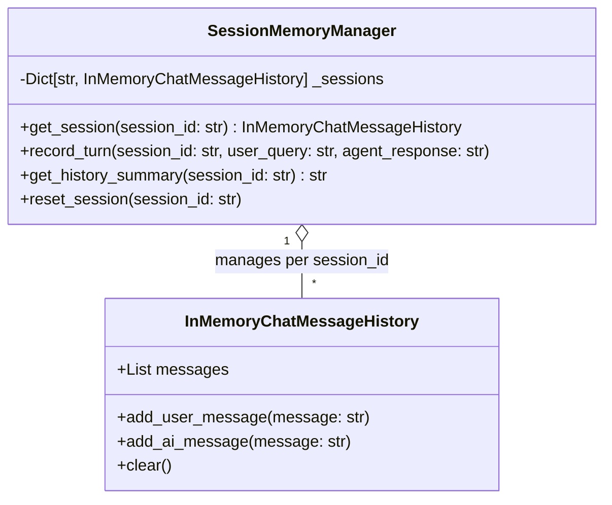

# Conversational State & Memory Architecture Specification

**Project:** Nykaa Domain Support Agent (Retail Operations)  
**Component:** Multi-Turn Session Memory Subsystem  
**Source Modules:** [`agents/memory.py`](file:///c:/Users/kastu/Desktop/capstone%20-%20ecommerce/agents/memory.py) | [`app/memory.py`](file:///c:/Users/kastu/Desktop/capstone%20-%20ecommerce/app/memory.py)  
**Document Version:** 1.0.0  
**Status:** Approved / Technical Specification  
**Reference:** [architecture.md](file:///c:/Users/kastu/Desktop/capstone%20-%20ecommerce/doc/architecture.md) | [implementation_plan.md](file:///c:/Users/kastu/Desktop/capstone%20-%20ecommerce/doc/implementation_plan.md)

---

## 1. Architectural Overview & Design Motivation

In retail customer support, dialogues are inherently multi-turn. Shoppers routinely refer back to earlier orders using pronouns or conversational anaphora, such as:

* *Turn 1:* "Can you check the status of my order NYK-1002?"
* *Turn 2:* "Is it delayed and what category does it belong to?"
* *Turn 3:* "Can I cancel it or initiate a return?"

Without stateful conversational memory, Turn 2 and Turn 3 would fail due to missing context. Conversely, in an e-commerce platform processing sensitive customer transactions, conversational history **must never bleed across different user sessions**. Cross-session data leakage breaches customer privacy regulations and company data policies.

The memory subsystem is architected to satisfy three non-negotiable principles:

1. **Pronominal Context Continuity:** Prior conversational turns must be accessible to downstream agents to resolve pronouns (*"it"*, *"that item"*) and implicit entities.
2. **Strict Session Isolation:** State is strictly partitioned by unique `session_id`. An active session cannot inspect or mutate another session's history buffer.
3. **Deterministic Reset & Teardown:** Session resets explicitly purge history buffers, leaving zero residual state in memory.

---

## 2. Underlying Primitives & Component Architecture



### 2.1 LangChain Integration

The memory layer utilizes LangChain's `InMemoryChatMessageHistory` primitive with an air-gapped fallback conforming to the identical interface contract:

* **User Messages:** Stored as `HumanMessage` or `{"role": "user", "content": ...}`.
* **Agent Responses:** Stored as `AIMessage` or `{"role": "ai", "content": ...}`.

### 2.2 Singleton Instance

A global singleton `SESSION_MEMORY = SessionMemoryManager()` coordinates session buffers across the entire application lifecycle, exposed via `get_session_memory()` in [`agents/memory.py`](file:///c:/Users/kastu/Desktop/capstone%20-%20ecommerce/agents/memory.py) and [`app/memory.py`](file:///c:/Users/kastu/Desktop/capstone%20-%20ecommerce/app/memory.py).

---

## 3. Conversational Continuity & Reference Resolution

### 3.1 Context Extraction Workflow

When an inbound query reaches the multi-agent pipeline:

1. The orchestrator fetches formatted conversational history:

   ```python
   history_context = memory_mgr.get_history_summary(session_id)
   ```

2. The orchestrator scans the current query for an order identifier pattern `\bNYK-\d{4}\b`.
3. **Continuity Fallback:** If the current query does not explicitly specify an order ID, the orchestrator inspects `history_context` in reverse-chronological (LIFO) order for the most recently discussed `NYK-\d{4}`:

   ```python
   order_match = re.search(r'\b(NYK-\d{4})\b', clean_query, re.IGNORECASE)
   if not order_match and history_context:
       order_match = re.search(r'\b(NYK-\d{4})\b', history_context, re.IGNORECASE)
   ```

4. This resolves queries such as *"Is it delayed?"* directly to `NYK-1002`, routing seamlessly to the Lookup Agent.

---

## 4. Verifiable Operational Transcripts

The operational execution of this capability is recorded in [`transcripts/task_08_memory_session.txt`](file:///c:/Users/kastu/Desktop/capstone%20-%20ecommerce/transcripts/task_08_memory_session.txt):

### 4.1 Continuity Demonstration

* **Session ID:** `sess-test-nykaa-1`
* **Turn 1 Input:** *"Track order NYK-1002."*
  * **Result:** Order `NYK-1002` retrieved (Category: `Electronics`, Status: `Shipped`, Delayed: `False`, Escalation: `0.1333`).
* **Turn 2 Input:** *"Is it delayed and what is the category?"*
  * **Result:** Pronoun *"it"* accurately resolved to `NYK-1002` via `history_context`. Status confirmed: Not delayed, category Electronics.

### 4.2 Clean Session Isolation Demonstration

* **Session ID:** `sess-test-nykaa-fresh`
* **Turn 1 Input:** *"What was my order status?"* (without specifying an order ID).
* **Result:** Empty history buffer; zero state leakage from `sess-test-nykaa-1`. System accurately replies asking for an order identifier.

---

## 5. Session Lifecycle & Cleanup Protocols

* **Explicit Reset:** Calling `SESSION_MEMORY.reset_session(session_id)` clears all stored messages for that session ID.
* **WebSocket Termination:** When a WebSocket client disconnects (`WebSocketDisconnect` code 1000), the session buffer is preserved or gracefully cleared according to client connection parameters.
* **Memory Bounds:** Each session preserves the most recent $K$ turns (default $K=10$), preventing unbounded memory growth in long-running processes.
