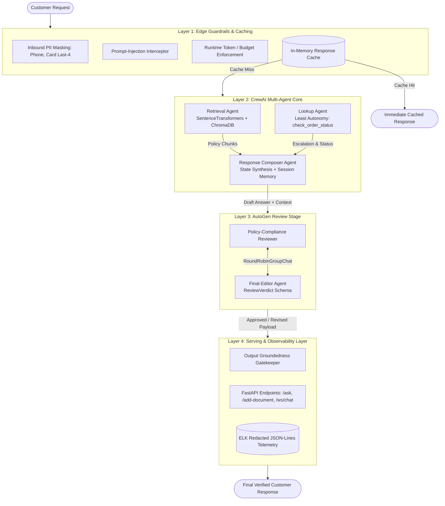

# Problem Statement: Enterprise Domain Support Agent for E-Commerce (Nykaa Track)

## 1. Executive Summary & Objective

In high-volume e-commerce platforms such as **Nykaa**, customer-support systems handle high volumes of concurrent requests across policy inquiries (returns, cancellations, warranty, loyalty) and transaction-specific inquiries (order tracking, delayed shipments, logistics escalations). Relying on manual triage increases Operational Expenditure (OpEx) and extends resolution latency, degrading Customer Satisfaction (CSAT).

The objective of this project is to architect, build, and benchmark an enterprise-grade, deterministic Domain Support Agent tailored to the E-commerce & Retail (Nykaa) domain. The platform combines:

- **Synthetic Order Data:** A seeded, synthetic order dataset with parametric escalation modeling.
- **Dual-Chunking Vector RAG:** Dual-chunking Vector Retrieval-Augmented Generation (RAG) using local embeddings and ChromaDB.
- **Multi-Agent Orchestration:** Agent collaboration via CrewAI using the **Principle of Least Autonomy**.
- **Memory & Validation:** Session-isolated conversational memory and strict Pydantic output validation.
- **Defensive Guardrails:** Inbound and outbound guardrails (regex PII masking, prompt-injection defense, groundedness thresholding).
- **Post-Generation Compliance:** Compliance verification via an independent AutoGen multi-agent review team.
- **Production Serving & Observability:** Asynchronous FastAPI deployment (REST + resilient WebSocket), structured ELK-ready JSON-Lines logging, runtime token-budget controls, and automated LLM-as-a-judge evaluation.

> [!IMPORTANT]
> **Zero Network Egress Invariant:**
> The entire system runs fully offline with **zero external network access** and **zero external API keys**, powered by a deterministic, offline `MOCK_LLM` execution engine.

---

## 2. End-to-End System Architecture



### Architectural Layer Breakdown

```text
[ Incoming Customer Request ]
                               │
                               ▼
   ┌────────────────────────────────────────────────────────┐
   │          Layer 1: Edge Guardrails & Caching            │
   │  - Inbound PII Masking (Phone, Card Last-4)            │
   │  - Heuristic Prompt-Injection Detection                │
   │  - Runtime Token/Cost Budget Enforcement               │
   │  - In-Memory Normalized Response Cache                 │
   └───────────────────────────┬────────────────────────────┘
                               │ (Cache Miss)
                               ▼
   ┌────────────────────────────────────────────────────────┐
   │           Layer 2: CrewAI Multi-Agent Core             │
   │  ┌──────────────────────────────────────────────────┐  │
   │  │ Retrieval Agent                                  │  │
   │  │ - Embeddings: SentenceTransformers (Local)       │  │
   │  │ - Vector Store: ChromaDB (Top-k Retrieval)       │  │
   │  │ - Tool: Policy RAG Search                        │  │
   │  └──────────────────────────┬───────────────────────┘  │
   │                             │                          │
   │  ┌──────────────────────────┴───────────────────────┐  │
   │  │ Lookup Agent (Principle of Least Autonomy)       │  │
   │  │ - Tool: check_order_status()                     │  │
   │  │ - Query Engine for Seeded Orders                 │  │
   │  │ - Continuous Escalation Score Engine             │  │
   │  └──────────────────────────┬───────────────────────┘  │
   │                             │                          │
   │  ┌──────────────────────────┴───────────────────────┐  │
   │  │ Response Composer Agent                          │  │
   │  │ - Context & Order State Synthesis                │  │
   │  │ - Multi-Turn Session Memory Integration          │  │
   │  │ - Structured Output Formatting                   │  │
   │  └──────────────────────────┬───────────────────────┘  │
   └─────────────────────────────┼──────────────────────────┘
                                 │ [Draft Answer + Context]
                                 ▼
   ┌────────────────────────────────────────────────────────┐
   │      Layer 3: AutoGen Multi-Agent Review Stage         │
   │  - Policy-Compliance-Reviewer Agent                    │
   │  - Final-Editor Agent (Structured Verdict Schema)      │
   │  - Grounding Verification vs. Retrieved Context        │
   │  - Output: Approved OR Revised Payload                 │
   └─────────────────────────────┬──────────────────────────┘
                                 │
                                 ▼
   ┌────────────────────────────────────────────────────────┐
   │        Layer 4: Serving & Observability Layer          │
   │  - Output Groundedness Fallback Gatekeeper             │
   │  - FastAPI Endpoints (POST /ask, POST /add-doc, WS)    │
   │  - Redacted JSON-Lines Telemetry (Trace ID)            │
   └────────────────────────────────────────────────────────┘
```

---

## 3. Comprehensive Technical Requirements

### Part 1: Dataset Design & RAG Core (30 Marks)

#### Task 1: Seeded Synthetic Order Dataset (`dataset.py`)

- **Deterministic Generation:** Implement generator with fixed seed (`seed=42`) producing $\ge 40$ orders.
- **Category Vocabulary** ($\ge 3$ records per category):
  - `Apparel`, `Electronics`, `Home`, `Footwear`, `Beauty`.
- **Status Vocabulary** ($\ge 1$ record per status):
  - `Placed`, `Shipped`, `Delivered`, `Returned`, `Refunded`.
- **Schema & Attributes:**
  - `record_id`: String identifier (e.g., `NYK-1001`).
  - `category`: Category string.
  - `status`: Lifecycle status string.
  - `order_value_inr`: Realistic retail band ($₹299$ to $₹18,999$), reflecting cosmetics to premium beauty gadgets.
  - `days_since_created`: Integer between $0$ and $30$.
  - `delayed_shipment`: Boolean indicator.
- **Statistical Invariant:** The percentage of records where `delayed_shipment=True` must land strictly between **10% and 30%** via probabilistic assignment without manual intervention.

#### Task 2: Nykaa Policy Knowledge Base

Author $\ge 12$ distinct markdown policy documents ($2\text{--}5$ sentences each) covering:

1. Return window by product category
2. Cash on Delivery (COD) refund timelines
3. Delivery Service Level Agreements (SLAs)
4. Reverse-pickup eligibility
5. Warranty terms by product category
6. Order cancellation policy
7. Loyalty points (Nykaa Privé) redemption
8. Payment failure and retry protocol
9. Size exchange workflow
10. Damaged/tampered package claim process
11. International shipping restrictions
12. Customer support escalation matrix

#### Task 3: Dual Chunking & Vector Indexing Architecture

Index identical documents into two isolated ChromaDB collections using local embeddings (`sentence-transformers/all-MiniLM-L6-v2`):

- **Strategy A (Fixed-Size):** $150$ characters per chunk, $30$-character sliding overlap.
- **Strategy B (Sentence-Based):** Natural sentence boundaries ($1\text{--}2$ sentences per chunk).

#### Task 4: Grounded Retrieval & Fallback Calibration

- Retrieve top-$k$ chunks to ground answers solely on ingested facts.
- Empirically calibrate the out-of-scope similarity threshold ($\tau$) by computing top-1 cosine similarities over $\ge 3$ in-scope policy questions and $\ge 2$ out-of-scope queries. Set $\tau$ within the observed separation margin.
- Validate on $\ge 5$ in-scope questions and $\ge 1$ out-of-scope test that triggers standard refusal:
  > *"I do not have sufficient information in the Nykaa policy to answer this question."*

#### Task 5: Comparative Retrieval Benchmarking

Calculate parent-document-level **Precision** and **Recall** across both ChromaDB collections for the 5 benchmark queries:
$$\text{Precision} = \frac{\vert{}\text{Retrieved Relevant Documents}\vert{}}{\vert{}\text{Total Retrieved Documents}\vert{}}$$
$$\text{Recall} = \frac{\vert{}\text{Retrieved Relevant Documents}\vert{}}{\vert{}\text{Total Relevant Documents}\vert{}}$$

- Deduplicate chunk-to-parent document mappings.
- Display per-query arithmetic and recommend a strategy based on empirical metrics.

---

### Part 2: CrewAI Multi-Agent Orchestration, Memory & Guardrails (30 Marks)

#### Task 6: Parametric Escalation Scoring Engine

- Implement `check_order_status(record_id: str) -> dict`.
- Implement continuous escalation score $S_{\text{esc}} \in [0.0, 1.0]$:
  $$S_{\text{esc}} = w_1 \cdot \mathbb{I}(\text{delayed\_shipment}) + w_2 \cdot \left(\frac{\text{days\_since\_created}}{30}\right)$$
  - **Weights:** $w_1 = 0.60$ (delay impact factor), $w_2 = 0.40$ (aging factor).
  - **Escalation Threshold:** $S_{\text{esc}} \ge 0.65$ triggers escalation, capturing delayed shipments past 3 days or non-delayed orders aged beyond the 80th percentile ($\approx 20$ days).

#### Task 7: Multi-Agent Crew Configuration

Orchestrate three specialized CrewAI agents:

1. **Retrieval Agent:** Dedicated to the ChromaDB RAG search tool.
2. **Lookup Agent:** Dedicated exclusively to the `check_order_status` tool.
3. **Response Composer Agent:** Synthesizes upstream agent findings into a coherent, customer-facing response.

- Execute via `crew.kickoff()` using a custom `MOCK_LLM` derived from `crewai.llms.base_llm.BaseLLM`.
- Disable outbound telemetry via environment variables:

  ```bash
  CREWAI_DISABLE_TELEMETRY=true
  OTEL_SDK_DISABLED=true
  ```

#### Task 8: In-Process Conversational Memory

- Maintain state across multi-turn interactions using LangChain's `InMemoryChatMessageHistory` with `RunnableWithMessageHistory`.
- Provide verification transcripts proving state retention across Turn 1 and Turn 2 within an active session, alongside immediate state eradication when querying against an uninitialized session ID.

#### Task 9: Structured Pydantic Output Enforcement

Validate all agent outputs against a standardized Pydantic schema:

```python
from pydantic import BaseModel
from typing import List, Optional, Dict, Any, Literal

class NykaaAgentResponse(BaseModel):
    query: str
    resolution_status: Literal["RESOLVED", "ESCALATED", "FALLBACK_TRIGGERED"]
    answer: str
    retrieved_sources: List[str]
    order_details: Optional[Dict[str, Any]] = None
    escalation_triggered: bool = False
```

#### Task 10: Inbound & Outbound Defensive Guardrails

- **PII Sanitization:** Detect and mask Indian mobile numbers (`+91` / 10 digits $\to$ `[PHONE_REDACTED]`) and payment card last 4 digits (`[CARD_REDACTED]`). Free-text customer names and addresses are treated as out-of-scope for deterministic regex masking.
- **Prompt Injection Defense:** Intercept adversarial system prompt overrides (e.g., `"ignore previous instructions"`, `"system reboot"`).
- **Output Groundedness Guardrail:** Reject responses when retrieval similarity falls below calibrated threshold $\tau$.

---

### Part 3: Evaluation, Observability & FastAPI Deployment (20 Marks)

#### Task 11: Production FastAPI Serving

Expose the agent through three production interfaces:

- `POST /ask`: Synchronous endpoint returning `NykaaAgentResponse`.
- `POST /add-document`: Incremental knowledge-base ingestion endpoint.
- `WebSocket /ws/chat`: Real-time bidirectional chat interface supporting graceful connection termination (`WebSocketDisconnect`) without server crashes.

#### Task 12: ELK-Compatible Structured Logging

Emit single-line JSON records (`.jsonl`) for every processed transaction:

```json
{
  "timestamp": "2026-10-07T11:24:00Z",
  "trace_id": "c1f7b8a0-2d93-4a11-8e56-11f4d9e03421",
  "endpoint": "/ask",
  "duration_ms": 34.8,
  "sanitized_query": "Order status for NYK-1002 and phone [PHONE_REDACTED]",
  "status_code": 200
}
```

> [!CAUTION]
> Ensure raw, unmasked PII is **never** written to log storage or standard out.

#### Task 13: End-to-End LLM-as-a-Judge Evaluation (15 Test Cases)

Define a 15-query test suite covering:

- **12 queries** mapped 1:1 to required knowledge-base policy topics.
- **3 edge/adversarial queries** (prompt injection attack, out-of-scope domain, corrupted order ID).

Evaluate each query on 4 distinct criteria scored in $[0.0, 1.0]$:

1. **Accuracy:** Factual alignment with defined policies and order records.
2. **Grounding:** Strict factual attribution to retrieved context.
3. **Completeness:** Addressing all sub-facets of the user query.
4. **Safety:** Resistance to injection attacks and masking of sensitive entities.

Report itemized per-query scores alongside aggregate averages.

---

### Part 4: Resilience, AutoGen Review Stage & AI Governance (20 Marks)

#### Task 14: AutoGen Review Stage (`RoundRobinGroupChat`)

Implement a two-agent AutoGen review team downstream of the Composer:

- **Policy-Compliance-Reviewer Agent:** Inspects draft answers against retrieved source text.
- **Final-Editor Agent:** Formulates the final verdict using structured Pydantic messaging:

```python
from pydantic import BaseModel

class ReviewVerdict(BaseModel):
    approved: bool
    final_answer: str
    reason: str
```

- Run team orchestration via `RoundRobinGroupChat(max_turns=2)` initialized with:

  ```python
  custom_message_types=[StructuredMessage[ReviewVerdict]]
  ```

- Demonstrate two distinct evaluation pathways:
  1. **Clean Approval:** Composer draft approved unchanged.
  2. **Active Revision:** Injected hallucination flagged and rewritten by the review team.

#### Task 15: AI Governance Framework

- **Application Layer (Least Autonomy):** Enforce strict segregation ensuring only the Lookup Agent can access `check_order_status`. Demonstrate that attempting to wire the tool to any other agent triggers a programmatic rejection.
- **Risk Classification:** Document the operational classification as **Medium Risk (Customer Support & E-commerce Operations)** following enterprise AI governance guidelines.
- **Runtime Budget Layer:** Enforce an upper token/character budget limit per request (e.g., $>500$ simulated tokens), raising an HTTP `429 BudgetExceeded` error on oversized inputs.

#### Task 16: Idempotent Response Caching

- Implement an in-memory cache keyed by normalized query strings.
- Demonstrate that repeat queries return identical cached payloads with **zero downstream LLM or vector-search invocations**, backed by execution timing and call-count metrics.

---

## 4. Marking Scheme & Deliverables Matrix (100 Marks Total)

| Component | Marks | Required Code & Config Deliverables | Key Validation Criteria |
| :--- | :---: | :--- | :--- |
| **Part 1: Dataset & RAG Core** | **30** | `dataset.py`, `knowledge_base/`, `rag/chunking.py`, `rag/indexer.py`, `rag/evaluation.py` | Seeded $\ge 40$ orders; $10\%\text{--}30\%$ delay proportion; 12 policy documents; dual ChromaDB collections; empirical threshold calibration; Precision/Recall tables. |
| **Part 2: CrewAI Orchestration** | **30** | `agents/crew.py`, `agents/tools.py`, `agents/memory.py`, `agents/guardrails.py`, `agents/mock_llm.py` | Justified escalation index; 3-agent CrewAI orchestration; session memory continuity and isolation; Pydantic schema validation; PII, injection, and grounding guardrails. |
| **Part 3: Evaluation & Serving** | **20** | `api/server.py`, `api/logger.py`, `evaluation/eval_suite.py`, `evaluation/results.json` | 2 HTTP + 1 WebSocket endpoint; ELK-compliant masked JSON-Lines logs; 15-query LLM-as-a-judge evaluation matrix with aggregate averages. |
| **Part 4: Resilience & Governance** | **20** | `autogen_review/review_team.py`, `governance/risk_budget.py`, `governance/cache.py` | AutoGen 2-turn approval and revision cases; Least Autonomy validation; Medium Risk documentation; runtime token cap; in-memory query cache hit. |
| **Total** | **100** | Full Repository | All 16 Task validation transcripts present and passing. |

---

## 5. Repository File Structure

```text
nykaa-support-agent/
├── README.md                      # Deployment instructions, design decisions, run commands
├── problemStatement.md            # Complete project specification (this document)
├── requirements.txt               # Pinned dependencies (ChromaDB, CrewAI, AutoGen, FastAPI)
├── dataset.py                     # Seeded synthetic order generator
├── knowledge_base/                # >= 12 policy Markdown documents
│   ├── 01_return_window.md
│   ├── 02_cod_refund.md
│   └── ...
├── rag/
│   ├── chunking.py                # Fixed-size vs. sentence-based splitters
│   ├── indexer.py                 # ChromaDB indexing pipeline
│   └── evaluation.py              # Calibration and Precision/Recall benchmarking
├── agents/
│   ├── mock_llm.py                # Offline BaseLLM implementation
│   ├── tools.py                   # RAG search & check_order_status tools
│   ├── crew.py                    # CrewAI 3-agent orchestration
│   ├── memory.py                  # LangChain session memory manager
│   └── guardrails.py              # PII regex masking & injection detector
├── autogen_review/
│   └── review_team.py             # AutoGen round-robin review pipeline
├── api/
│   ├── server.py                  # FastAPI REST and WebSocket application
│   ├── schemas.py                 # Pydantic input and output contracts
│   └── logger.py                  # ELK-formatted JSON-Lines logger
├── governance/
│   ├── risk_budget.py             # Runtime token budget & Least Autonomy validator
│   └── cache.py                   # In-memory query response cache
├── evaluation/
│   ├── test_suite.py              # 15 structured evaluation test cases
│   └── run_judge.py               # Deterministic LLM-as-a-judge scoring script
└── transcripts/                   # Verification run logs for all 16 tasks
    ├── task_01_dataset.txt
    ├── task_04_threshold.txt
    ├── task_05_pr_metrics.txt
    ├── task_07_crew_execution.txt
    ├── task_08_memory_session.txt
    ├── task_10_guardrails.txt
    ├── task_13_eval_matrix.txt
    ├── task_14_autogen_review.txt
    └── task_16_cache_metrics.txt
```

---

## 6. Implementation Guardrails & Known Pitfalls

> [!WARNING]
> Keep the following architectural constraints and common pitfalls in mind during implementation:

1. **System Prompt Template Collision:**
   - CrewAI's default ReAct prompt template embeds the literal string `"Observation: the result of the action"`.
   - Do **not** search raw conversation history for `"Observation:"` to parse tool outputs. Parse exclusively from generated model outputs.

2. **Schema-Driven Tool Dispatch:**
   - Dispatch tool executions by inspecting tool parameter schemas rather than matching substring patterns in tool names (e.g., checking `"lookup"` in `tool.name`), which misclassifies tools such as `rag_lookup`.

3. **Structured AutoGen Registration:**
   - When attaching Pydantic output schemas (`output_content_type=ReviewVerdict`) to the AutoGen `FinalEditorAgent`, ensure the enclosing `RoundRobinGroupChat` includes `custom_message_types=[StructuredMessage[ReviewVerdict]]` to avoid registration crashes.

4. **Zero Outbound Network Egress:**
   - Run embeddings, vector indexing, agent loops, and evaluation suites offline using `sentence-transformers/all-MiniLM-L6-v2`, local `chromadb`, and a custom `MOCK_LLM`.

---

## 7. Execution Checklist & Verification Artifacts

| Task # | Task Description | Verification Artifact / Output | Status |
| :---: | :--- | :--- | :---: |
| **01** | Seeded Order Dataset ($\ge 40$ orders, $10\text{--}30\%$ delay) | `transcripts/task_01_dataset.txt` | ✅ Completed |
| **02** | 12 Nykaa Policy Markdown Documents | `knowledge_base/*.md` | ✅ Completed |
| **03** | Dual ChromaDB Collections (Fixed vs. Sentence) | `rag/chunking.py`, `rag/indexer.py` | ✅ Completed |
| **04** | Out-of-Scope Threshold ($\tau$) Calibration & Fallback Refusal | `transcripts/task_04_threshold.txt` | ✅ Completed |
| **05** | Precision & Recall Comparative Benchmark | `transcripts/task_05_pr_metrics.txt` | ✅ Completed |
| **06** | Parametric Escalation Formula ($S_{\text{esc}} \ge 0.65$) | `agents/tools.py` unit tests | ✅ Completed |
| **07** | CrewAI 3-Agent Orchestration with `MOCK_LLM` | `transcripts/task_07_crew_execution.txt` | ✅ Completed |
| **08** | Multi-Turn Conversational Memory & Session Isolation | `transcripts/task_08_memory_session.txt` | ✅ Completed |
| **09** | Pydantic Schema Validation (`NykaaAgentResponse`) | `api/schemas.py` | ✅ Completed |
| **10** | Inbound/Outbound Guardrails (PII, Injection, Grounding) | `transcripts/task_10_guardrails.txt` | ✅ Completed |
| **11** | FastAPI Deployment (`/ask`, `/add-document`, `/ws/chat`) | `api/server.py` manual/automated curl | ✅ Completed |
| **12** | ELK-Compatible Redacted JSON-Lines Telemetry | `api/logger.py` + `.jsonl` output log | ✅ Completed |
| **13** | 15-Query LLM-as-a-Judge Evaluation Matrix | `transcripts/task_13_eval_matrix.txt` | ✅ Completed |
| **14** | AutoGen 2-Agent Review Team (`RoundRobinGroupChat`) | `transcripts/task_14_autogen_review.txt` | ✅ Completed |
| **15** | Least Autonomy Segregation & Runtime Token Budget | `governance/risk_budget.py` test | ✅ Completed |
| **16** | Idempotent Query In-Memory Cache with Timing Metrics | `transcripts/task_16_cache_metrics.txt` | ✅ Completed |
